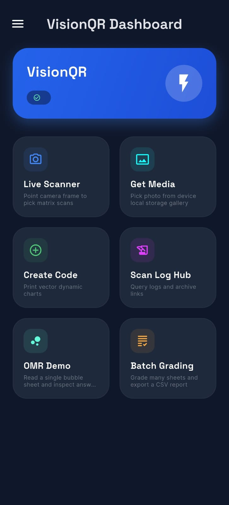
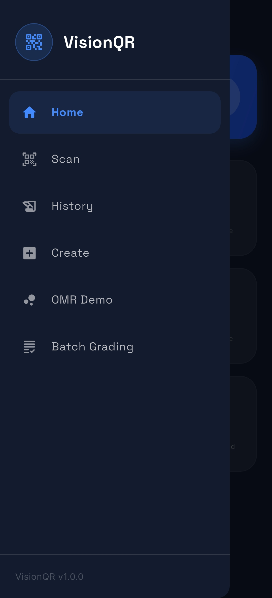
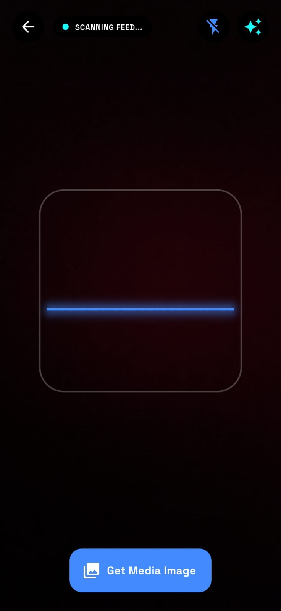
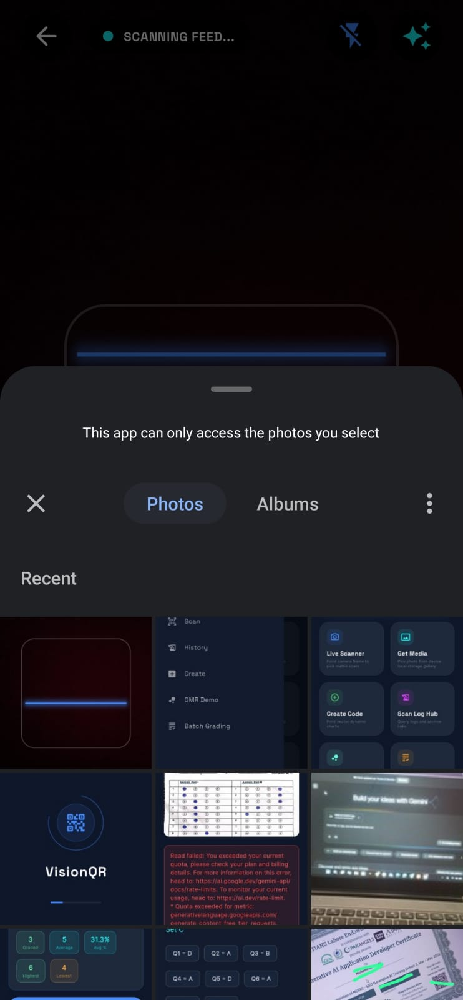
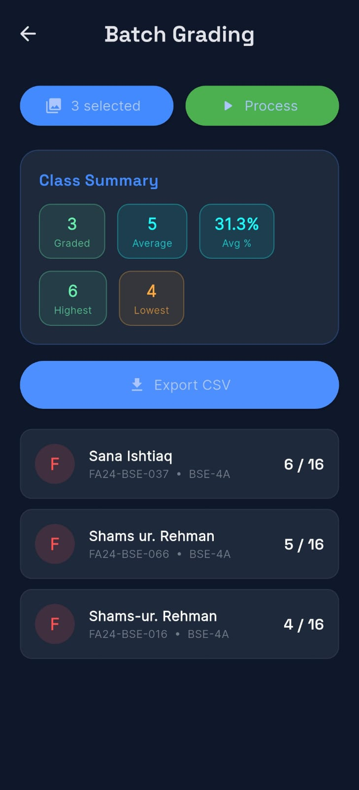
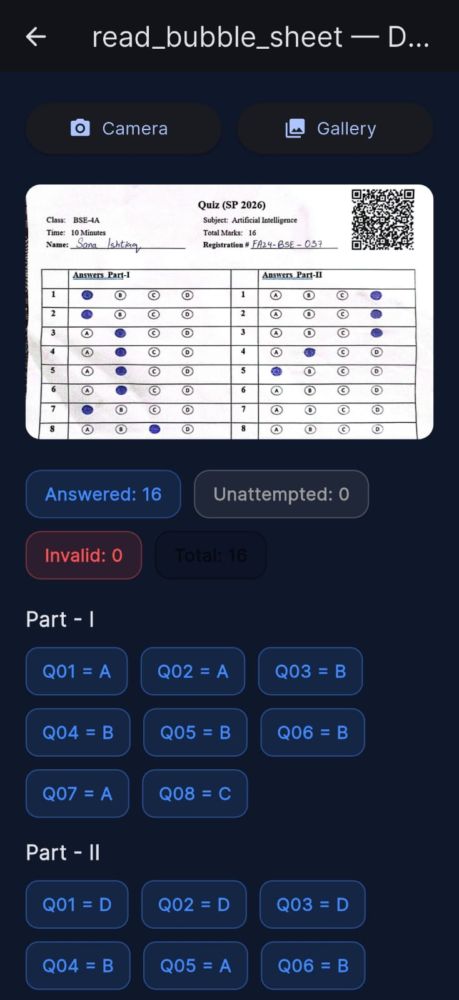
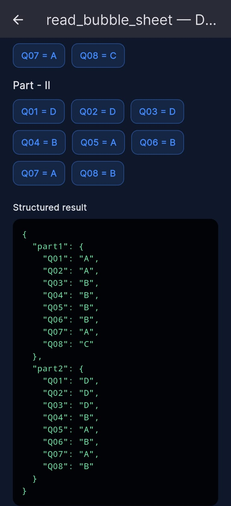
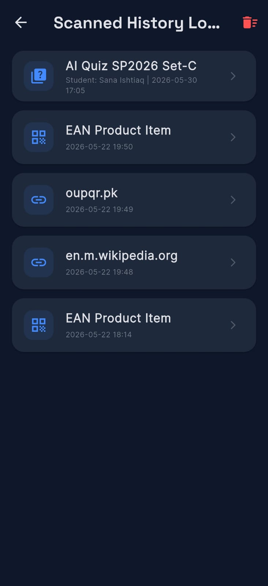

# VisionQR – AI-Powered QR & OMR Evaluation System



## 📌 Project Overview

VisionQR is an AI-powered quiz evaluation application that combines QR Code recognition and OMR (Optical Mark Recognition) technology to automate the assessment process. The system allows users to scan answer sheets, detect QR codes, extract student information, evaluate marked answers, and generate result files automatically.

The goal of this project is to reduce manual grading effort, improve accuracy, and provide a fast and efficient evaluation workflow for educational institutions.

---

## ✨ Key Features

* QR Code generation and scanning
* OMR bubble detection and evaluation
* Automatic answer checking
* Student response processing
* Batch grading support
* History management
* CSV result generation
* User-friendly interface

---

## ✅ Tasks Completed

### Task 1 – QR Code Processing

* Generated QR codes for quiz sheets.
* Decoded QR codes from uploaded images.
* Extracted encoded student and quiz information.

### Task 2 – Image Processing

* Applied image preprocessing techniques.
* Improved image quality for accurate detection.
* Prepared scanned sheets for analysis.

### Task 3 – OMR Detection

* Detected answer bubbles from quiz sheets.
* Identified filled and unfilled options.
* Processed marked responses automatically.

### Task 4 – Answer Evaluation

* Compared detected answers against answer keys.
* Calculated scores automatically.
* Generated evaluation results.

### Task 5 – CSV Output Generation

* Exported grading results in CSV format.
* Stored processed student records.
* Generated structured result files for further analysis.

---

## For Best User Experience

The accuracy of OMR detection depends heavily on image quality.

The system may fail to correctly detect responses if:

* The answer sheet is blurry.
* The scan is tilted excessively.
* The image contains shadows.
* Bubbles are not filled clearly.
* The sheet is damaged or incomplete.
* The image resolution is too low.

For best results:

* Use high-quality scans.
* Ensure proper lighting.
* Keep sheets flat while scanning.
* Fill bubbles completely and clearly.

---

## 🛠 Technologies & Libraries Used

### Programming Language

* Dart
* Flutter

### Framework

* Flutter SDK

### Libraries & Packages

* image_picker
* qr_flutter
* mobile_scanner
* csv
* path_provider
* provider
* image
* flutter_svg

### Data Storage

* CSV Files

### Platforms

* Android
* Windows
* Web (Flutter Supported)

---

## 🚀 Installation & Setup

### 1. Clone Repository

```bash
git clone https://github.com/sanaa-kh-37/VisionQR.git
```

### 2. Open Project

Open the project in Android Studio or VS Code.

### 3. Install Dependencies

```bash
flutter pub get
```

### 4. Run Application

```bash
flutter run
```

For Android:

```bash
flutter run -d android
```

For Windows:

```bash
flutter run -d windows
```

---

## 📖 How to Use

### Create QR

1. Open the application.
2. Navigate to Create QR.
3. Enter required information.
4. Generate the QR code.

### Scan QR

1. Open the scanner.
2. Scan the QR code.
3. Extract encoded data automatically.

### OMR Evaluation

1. Upload answer sheet image.
2. Upload answer key if required.
3. Start evaluation.
4. Review detected responses.
5. Export results.

### Batch Grading

1. Upload multiple answer sheets.
2. Run batch processing.
3. Generate combined results.

---

## 📸 Application Screenshots

### Splash Screen


### Dashboard


### Navigation Interface



### Create QR Screen


### Get Media Screen



### Get Media Result



### Batch Grading



### OMR Detection



### OMR Detection Result



### History Screen




---

## 📊 Sample Output

A sample CSV output file is included in the repository.

Location:

```text
sample_outputs/AI_Quiz_SP2026_Set_C_clean.csv
```

Example Output:

| Student ID | Score |
| ---------- | ----- |
| 1001       | 18/20 |
| 1002       | 16/20 |
| 1003       | 20/20 |

---

## 📂 Project Structure

```text
VisionQR
│
├── Images/
│
├── android/
├── ios/
├── lib/
├── linux/
├── macos/
├── web/
├── windows/
│
├── test/
│
├── README.md
├── pubspec.yaml
└── pubspec.lock
```

---

## 👥 Team Contributions

Sana Ishtiaq
Habiba Gul

---

## 🔮 Future Enhancements

* Support for additional OMR sheet templates.
* Improved image correction and rotation handling.
* Excel (.xlsx) export support.
* Cloud-based grading system.
* Enhanced AI-powered answer detection.
* Better handling of damaged or low-quality sheets.

---


